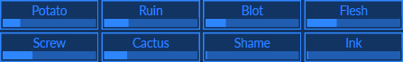
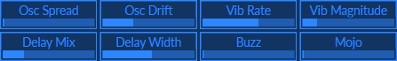
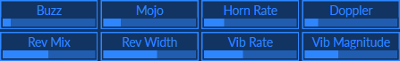
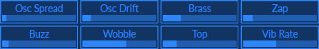
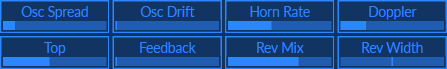

toddhisattva's Surge patches
============================
Hook up your levers and knobs!
------------------------------
All (but one) of these patches have all eight of Surge's <a href="https://surge-synthesizer.github.io/manual/#assignable-controllers">Assignable Controllers</a> hooked up.  If you have enough sliders and/or knobs, hook them up to Surge by right-clicking on each of the Assignable Controllers and choosing "learn controller" then wiggling your control:

If you do not have a MIDI controller you can use your mouse to mousenipulate the Assignable Controllers.

Please do not neglect your mod wheel!

I like velocity sensitivity and I hope you do too.

Tactar
------
**Tactar** is a sitar-like sound.  [It sounds like this.](https://raw.githubusercontent.com/ToddHartmann/patches/master/happen.mp3)

|||
|-|-|
|**Uni Spread**|Wildness control|
|**Osc Drift**|Adds randomness to osc pitches|
|**Vib Rate**|Vibrato Rate|
|**Vib Magnitude**|Vibrato Magnitude|
|**Formant**|Woody to nasal|
|**Yaced**|Opposite of Decay|
|**Niatsus**|Opposite of Sustain|
|**Esaeler**|Opposite of Release|
|**Mod Wheel**|Saturation|

Talienmachi
--
I was outside and heard a thump.  Turning around, I saw what was obviously an alien machine from outer space; I took it inside.  It had exactly eight knobs.  I was able to model its sounds and tried to translate what the labels near the knobs seemed to imply.  Then it evaporated, leaving a used motor oil scent.

Tarinet
--
**Tarinet** takes the lead vocal in [Color My Surge](https://raw.githubusercontent.com/ToddHartmann/patches/readme-reinit/Tarinet.mp3).
Maybe it's more of a bass clarinet.

|||
|-|-|
|**Osc Spread**|Left-Right pitch difference|
|**Osc Drift**|Adds randomness to osc pitches|
|**Vib Rate**|Vibrato Rate|
|**Vib Magnitude**|Vibrato Magnitude|
|**Delay Mix**|How much delayed sound|
|**Delay Width**|Stereoness of delayed sound|
|**Buzz**|Exactly what you expect|
|**Mojo**|Resonance (maybe best as comedy)|
|**Mod Wheel**|Mellow to Strident to Thin|

Tawlk
---
**Tawlk** If a bell tried to talk...

|||
|-|-|
|**Buzz**|Kazooness|
|**Mojo**|Wahnousity|
|**Horn Rate**|Leslie's Speed|
|**Doppler**|Leslie's Depth|
|**Rev Mix**|How much reverb|
|**Rev Width**|Stereoness of reverb|
|**Vib Rate**|Vibrato Rate|
|**Vib Magnitude**|Vibrato Magnitude|
|**Mod Wheel**|Mellow to Strident to Thin|

Tawlkpyiana
---
**Tawlkpyiana** is almost exactly the same as **Tawlk**,
but the bell is brighter because it skips F1.

Tbestbrofbraz
---
I approached brass from the FM side.  I approached brass from the subtractive side.
Each side had what the other lacked, a problem easily solved
by [Surge's scenes!](https://surge-synthesizer.github.io/manual/#the-scene-concept)
It is the "Best of Both Brass" because of its two sides.

It handles all brass in [Surgerstition](https://github.com/ToddHartmann/patches/blob/readme-reinit/Superstition.mp3?raw=true)

|||
|-|-|
|**Osc Spread**|Left-Right pitch difference|
|**Osc Drift**|Adds randomness to osc pitches|
|**Horn Rate**|Leslie's Speed|
|**Doppler**|Leslie's Depth|
|**Splat**|Severity of Attack|
|**Mojo**|Resonance for Fun|
|**Delay Mix**|How much delayed sound|
|**Delay Width**|Stereoness of delayed sound|
|**Mod Wheel**|Mellow to Strident|

Tchime
---
Reminiscent of an [FM doorbell chime](Tchime.mp3), but useful for much else besides!

|||
|-|-|
|**Osc Spread**|Left-Right pitch difference|
|**Osc Drift**|Adds randomness to osc pitches|
|**Brass**|Adds some metallic harmonics|
|**Zap**|Opens filter, squeegies out ears|
|**Buzz**|Kazooness|
|**Wobble**|Wobulated high freqs|
|**Top**|Amount of up-octave osc|
|**Vib Rate**|Vibrato Rate|
|**Mod Wheel**|Vibrato Magnitude|

Tefbelmo
---
More [FM bell sweetness](Tefbelmo.mp3), the knobs can make it different, you gotta twist 'em!

|||
|-|-|
|**Osc Spread**|Left-Right pitch difference|
|**Osc Drift**|Adds randomness to osc pitches|
|**Horn Rate**|Leslie's Speed|
|**Doppler**|Leslie's Depth|
|**Top**|Amount of up-octave osc|
|**Feedback**|Takin' Care of Buzziness|
|**Rev Mix**|How much reverb|
|**Rev Width**|Stereoness of reverb|
|**Mod Wheel**|Leslie's Amplitude Modulation|

Tefempino.fxp
Temutu.fxp
Texedbaz.fxp
Texedbel.fxp
Thindo.fxp
Tokoto.fxp
Toneoscstryng.fxp
Torganix.fxp
Torganiy.fxp
Torganiz.fxp
Trawfm.fxp
Tscreeminhel.fxp
Tuub.fxp
Tuzz.fxp
