toddhisattva's Surge patches
============================

[Here they are in a zip](patches.zip).

Hook up your levers and knobs!
------------------------------
All (but one) of these patches have **all eight** of Surge's <a href="https://surge-synthesizer.github.io/manual/#assignable-controllers">Assignable Controllers</a> hooked up.  If you have enough sliders and/or knobs, hook them up to Surge by right-clicking on each of the Assignable Controllers and choosing "learn controller" then wiggling your control:

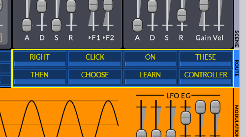

If you do not have a MIDI controller you can use your mouse to mousenipulate the Assignable Controllers.

Please do not neglect your mod wheel!

I like velocity sensitivity and I hope you do too.

Tactar
------
[**Tactar**](fxp/Tactar.fxp?raw=true) is a sitar-like sound.  [**It sounds like this**](sound/happen.mp3?raw=true).

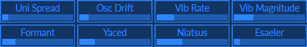

|||
|-|-|
|**Uni Spread**|Wildness control|
|**Osc Drift**|Natural-sounding pitch variation|
|**Vib Rate**|Vibrato Rate|
|**Vib Magnitude**|Vibrato Magnitude|
|**Formant**|Woody to nasal|
|**Yaced**|Opposite of Decay|
|**Niatsus**|Opposite of Sustain|
|**Esaeler**|Opposite of Release|
|**Mod Wheel**|Saturation|

Talienmachi
--
[**Talienmachi**](fxp/Talienmachi.fxp?raw=true) -
I was outside and heard a thump, and a noise that [**sounded like this**](sound/Talienmachi.mp3?raw=true).  Turning around, I saw what was obviously an alien machine from outer space.  I took it inside.  It had exactly eight knobs.  I was able to model its sounds and tried to translate what the labels near the knobs seemed to imply.  Then it evaporated, leaving a used motor oil scent.

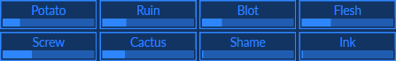

Tarinet
--
[**Tarinet**](fxp/Tarinet.fxp?raw=true) is an FM clarinet.  [**It sounds like this**](sound/Tarinet.mp3?raw=true).
Maybe it's more of a bass clarinet.

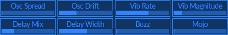

|||
|-|-|
|**Osc Spread**|Left-Right pitch difference|
|**Osc Drift**|Natural-sounding pitch variation|
|**Vib Rate**|Vibrato Rate|
|**Vib Magnitude**|Vibrato Magnitude|
|**Delay Mix**|How much delayed sound|
|**Delay Width**|Stereoness of delayed sound|
|**Buzz**|Exactly what you expect|
|**Mojo**|Resonance (maybe best as comedy)|
|**Mod Wheel**|Mellow to Strident to Thin|

Tawlk
---
[**Tawlk**](fxp/Tawlk.fxp?raw=true) - If a bell tried to talk it might [**sound like this**](sound/Tawlk.mp3?raw=true).

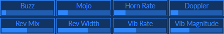

|||
|-|-|
|**Buzz**|Kazooness|
|**Mojo**|Wahnousity|
|**Horn Rate**|Leslie's Speed|
|**Doppler**|Leslie's Depth|
|**Rev Mix**|How much reverb|
|**Rev Width**|Stereoness of reverb|
|**Vib Rate**|Vibrato Rate|
|**Vib Magnitude**|Vibrato Magnitude|
|**Mod Wheel**|Mellow to Strident to Thin|

Tawlkpyiana
---
[**Tawlkpyiana**](fxp/Tawlkpyiana.fxp?raw=true) - [**Sounds like this**](sound/Tawlkpyiana.mp3?raw=true).
It's almost exactly the same as **Tawlk**,
but the bell is much brighter because it skips F1.  Has the same parameters.

Tbestbrofbraz
---
[**Tbestbrofbraz**](fxp/Tbestbrofbraz.fxp?raw=true) - [**Sounds like this**](sound/Tbestbrofbraz.mp3?raw=true), covering all brass and Moog bass (think "tuba").
I approached brass from the FM side.  I approached brass from the subtractive side.
Each side had what the other lacked, a problem easily solved
by [Surge's scenes](https://surge-synthesizer.github.io/manual/#the-scene-concept)!
It is the "Best of Both Brass" because of its two sides.

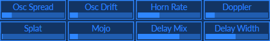

|||
|-|-|
|**Osc Spread**|Left-Right pitch difference|
|**Osc Drift**|Natural-sounding pitch variation|
|**Horn Rate**|Leslie's Speed|
|**Doppler**|Leslie's Depth|
|**Splat**|Severity of Attack|
|**Mojo**|Resonance for Fun|
|**Delay Mix**|How much delayed sound|
|**Delay Width**|Stereoness of delayed sound|
|**Mod Wheel**|Mellow to Strident|

Tchime
---
[**Tchime**](fxp/Tchime.fxp?raw=true) - [**Sounds like an FM doorbell chime**](sound/Tchime.mp3?raw=true), but useful for much else besides.

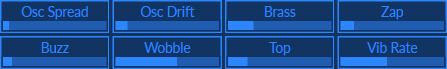

|||
|-|-|
|**Osc Spread**|Left-Right pitch difference|
|**Osc Drift**|Natural-sounding pitch variation|
|**Brass**|Adds some metallic harmonics|
|**Zap**|Opens filter, squeegies out ears|
|**Buzz**|Kazooness|
|**Wobble**|Wobulated high freqs|
|**Top**|Amount of up-octave osc|
|**Vib Rate**|Vibrato Rate|
|**Mod Wheel**|Vibrato Magnitude|

Tefbelmo
---
[**Tefbelmo**](fxp/Tefbelmo.fxp?raw=true) - [**Sounds like FM bell sweetness**](sound/Tefbelmo.mp3?raw=true), the knobs can make it different, you gotta twist 'em.

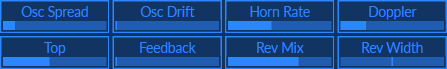

|||
|-|-|
|**Osc Spread**|Left-Right pitch difference|
|**Osc Drift**|Natural-sounding pitch variation|
|**Horn Rate**|Leslie's Speed|
|**Doppler**|Leslie's Depth|
|**Top**|Amount of up-octave osc|
|**Feedback**|Takin' Care of Buzziness|
|**Rev Mix**|How much reverb|
|**Rev Width**|Stereoness of reverb|
|**Mod Wheel**|Leslie's Amplitude Modulation|

Tefempino
---
[**Tefempino**](fxp/Tefempino.fxp?raw=true) - An FM piano that [**sounds like this**](sound/Tefempino.mp3?raw=true), handling all Rhodes/Wurly parts.

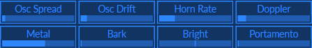

|||
|-|-|
|**Osc Spread**|Left-Right pitch difference|
|**Osc Drift**|Natural-sounding pitch variation|
|**Horn Rate**|Leslie's Speed|
|**Doppler**|Leslie's Depth|
|**Metal**|Xylo to half Glocked|
|**Bark**|Maybe like a bite|
|**Bright**|Get sunglasses|
|**Portamento**|Silliness|

I am sorry, I overlooked the mod wheel.  It does nothing.  This will be rectified soon.

Temutu
---
[**Temutu**](fxp/Temutu.fxp?raw=true) - [**Sounds like this**](sound/Temutu.mp3?raw=true), it's kinda fonky in case you meet a chameleon.

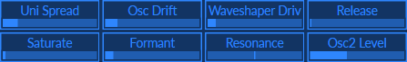

|||
|-|-|
|**Uni Spread**|Wildness control|
|**Osc Drift**|Natural-sounding pitch variation|
|**Waveshaper Driv**|Sine Distortion can get noisy|
|**Release**|Release on both EGs|
|**Saturate**|Enrich tone color|
|**Formant**|Full to Thin|
|**Resonance**|Wahnousity|
|**Osc2 Level**|Octave down osc level|
|**Mod Wheel**|Opens filter, squeegies out ears|

Texedbaz
---
[**Texedbaz**](fxp/Texedbaz.fxp?raw=true) is a synth bass that [**sounds like this**](sound/Texedbaz.mp3?raw=true).
It's a reconstruction of a patch for a DX7 or [Dexed](https://asb2m10.github.io/dexed/) and can be twisted to taste (or lack thereof).

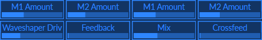

|||
|-|-|
|**M1 Amount**|Osc1 Thump to Rubber Band Man|
|**M2 Amount**|Osc1 Same but a little thinner|
|**M1 Amount**|Osc2 Brightness|
|**M2 Amount**|Osc2 Presence|
|**Waveshaper Driv**|Perks it right up|
|**Feedback**|Takin' Care of Buzziness|
|**Mix**|Stereo Delay Mix|
|**Crossfeed**|Stereo Delay Crossfeed|
|**Mod Wheel**|Stridency|

Texedbel
---
[**Texedbel**](fxp/Texedbel.fxp?raw=true) is another DX7/[Dexed](https://asb2m10.github.io/dexed/) adaptation
that [**sounds like this**](sound/Texedbel.mp3?raw=true).
Much more metallic than **Tefbelmo**, maybe more suited to gamelan.  Ever notice, a reference to gamelan always makes you seem musically sophisticated?  You don't even need to know what, or who, it is!

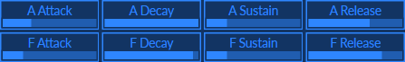

The knobs are hooked up to the Amplitude and Filter envelope generators.
In this FM patch, the Filter EG drives the FM modulator amounts (which changes timbre, like filters).
Set long Amplitude Attack for glass armonica sounds.  You know what to do.

Thindo
---
[**Thindo**](fxp/Thindo.fxp?raw=true) - Makes a very [**syncere sound**](sound/Thindo.mp3?raw=true), achieved with wavetable oscillators.

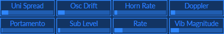

|||
|-|-|
|**Uni Spread**|Wildness control|
|**Osc Drift**|Natural-sounding pitch variation|
|**Horn Rate**|Leslie's Speed|
|**Doppler**|Leslie's Depth|
|**Portamento**|Sync likes Port|
|**Sub Level**|Meat|
|**Rate**|Vibrato Rate|
|**Vib Magnitude**|Vibrato Magnitude|
|**Mod Wheel**|Has its own LFO for its own vibrato|

Tokoto
---
[**Tokoto**](fxp/Tokoto.fxp?raw=true) - [**Sounds like a koto**](sound/Tokoto.mp3?raw=true), and can be a lot of other things, some of them good.

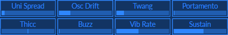

|||
|-|-|
|**Uni Spread**|Wildness control|
|**Osc Drift**|Natural-sounding pitch variation|
|**Twang**|That short little mash-down koto players do|
|**Portamento**|Longer glissandos here|
|**Thicc**|From thin to thicc|
|**Buzz**|Exactly what you expect|
|**Vib Rate**|Vibrato Rate|
|**Sustain**|For Amplitude EG|
|**Mod Wheel**|Vibrato Magnitude|

Toneoscstryng
---
[**Toneoscstryng**](fxp/Toneoscstryng.fxp?raw=true) is a one-oscillator [**string sound**](sound/Toneoscstryng.mp3?raw=true).

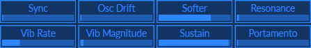

|||
|-|-|
|**Sync**|Gateway to Other Dimensions|
|**Osc Drift**|Natural-sounding pitch variation|
|**Softer**|Enmellowation|
|**Resonance**|Fiddle wooditude|
|**Vib Rate**|Vibrato Rate|
|**Vib Magnitude**|Vibrato Magnitude|
|**Sustain**|For both EGs|
|**Portamento**|Little thing stuffed in olives|
|**Mod Wheel**|Uni Spread Wildness control|

Torganix, Torganiy, Torganiz
---
[**Torganix**](fxp/Torganix.fxp?raw=true), [**Torganiy**](fxp/Torganiy.fxp?raw=true), and [**Torganiz**](fxp/Torganiz.fxp?raw=true)
are organ sounds.  **Torganiz** makes [**sounds like this**](sound/Torganiz.mp3?raw=true):

They differ only in the octave assignments of WT Oscs 2 & 3.
**Torganix** has the Oscs in 1:2:3 tuning, and might be a good start for drawbar organ sounds.
**Torganiy** moves Oscs 2 & 3 up one octave, for 1:4:6 kinda-pipe organy sound.
**Torganiz** moves Oscs 2 & 3 up two octaves, for 1:8:12 epic pipey sound.

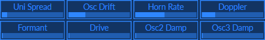

|||
|-|-|
|**Uni Spread**|Wildness control|
|**Osc Drift**|Natural-sounding pitch variation|
|**Horn Rate**|Leslie's Speed|
|**Doppler**|Leslie's Depth|
|**Formant**|Adds epicness until it doesn't|
|**Drive**|For Winwoods|
|**Osc2 Damp**|Scoop out the middle|
|**Osc3 Damp**|Take some off the top|
|**Mod Wheel**|Mighty Morphin|

Trawfm
---
[**Trawfm**](fxp/Trawfm.fxp?raw=true) is an FM3 oscillator laid bare to your fingertips.  Explore the worlds of FM synthesis and save off your interesting creations.  Enjoy!

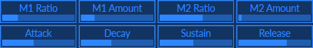

|||
|-|-|
|**M1 Ratio**|Choose a ratio|
|**M1 Amount**|Crank it up|
|**M2 Ratio**|Choose a ratio|
|**M2 Amount**|Crank it up|
|**Attack**|Amplitude EG|
|**Decay**|Amplitude EG|
|**Sustain**|Amplitude EG|
|**Release**|Amplitude EG|
|**Mod Wheel**|Vibrato speed & depth|

Tscreeminhel
---
[**Tscreeminhel**](fxp/Tscreeminhel.fxp?raw=true) - [**Sounds like a scream in hell**](sound/Tscreeminhel.mp3?raw=true).  A self-documenting patch: just this one bad sound try mod wheel.

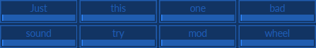

|||
|-|-|
|**Mod Wheel**|Opens filter, squeegies out ears|

Tuub
---
[**Tuub**](fxp/Tuub.fxp?raw=true), is like, tubular, totally.  [Bliss out](sound/Tuub.mp3?raw=true).

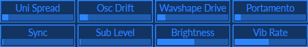

|||
|-|-|
|**Uni Spread**|Wildness control|
|**Osc Drift**|Natural-sounding pitch variation|
|**Waveshape Drive**|Stridency|
|**Portamento**|For classic square leads|
|**Sync**|Gateway to Other Dimensions|
|**Sub Level**|Girth|
|**Brightness**|Shiny|
|**Vib Rate**|Vibrato Rate|
|**Mod Wheel**|Vibrato Magnitude|

Tuzz
---
[**Tuzz**](fxp/Tuzz.fxp?raw=true) is an [agressive buzz sound](sound/Tuzz.mp3?raw=true).

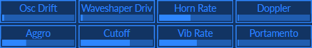

|||
|-|-|
|**Uni Spread**|Wildness control|
|**Osc Drift**|Natural-sounding pitch variation|
|**Horn Rate**|Leslie's Speed|
|**Doppler**|Leslie's Depth|
|**Aggro**|Agression / Aggrevation|
|**Cutoff**|Opens filter, squeegies out ears|
|**Vib Rate**|Vibrato Rate|
|**Portamento**|Gliss Bliss|
|**Mod Wheel**|Vibrato Magnitude|
